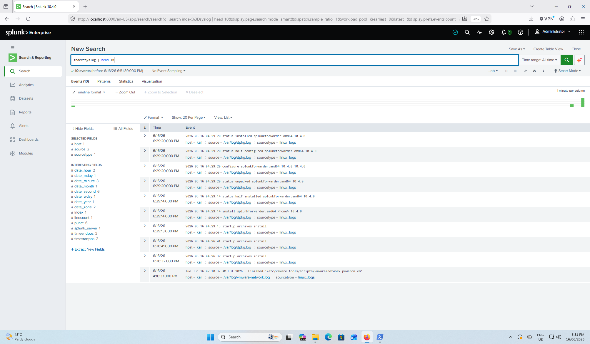
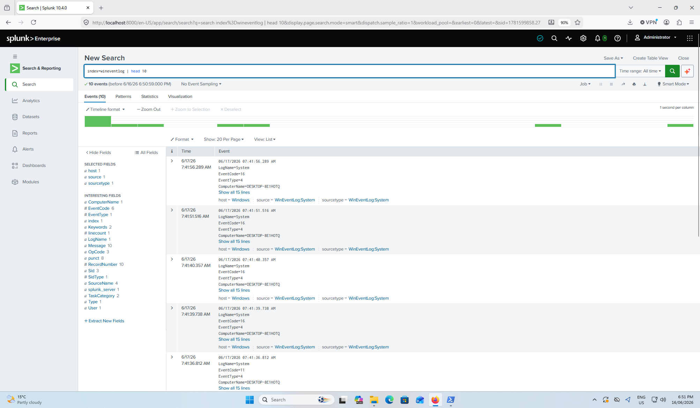
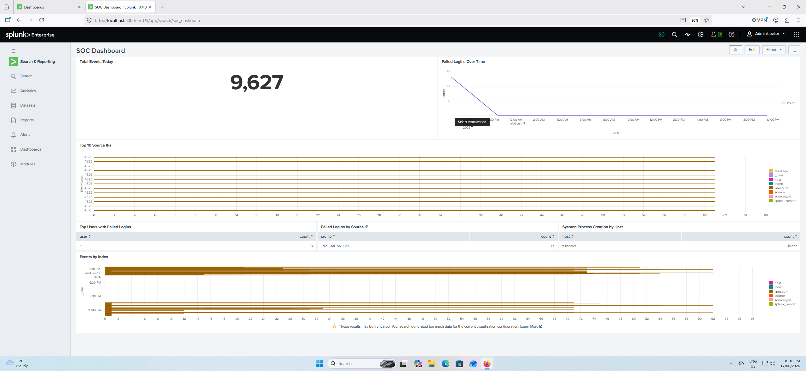
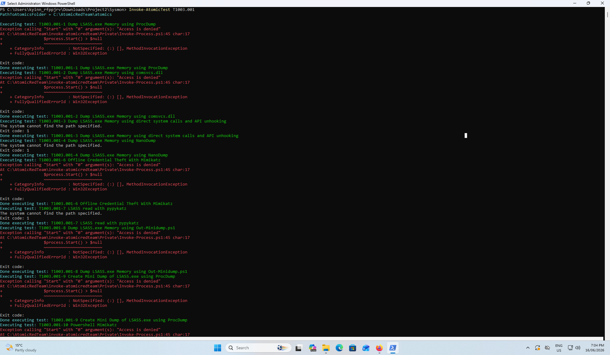
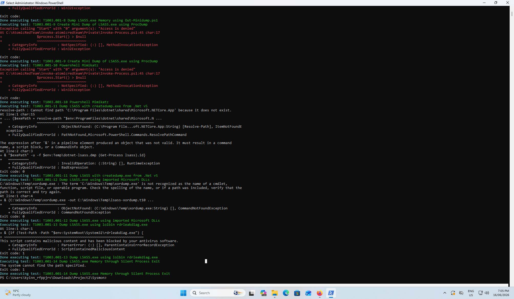
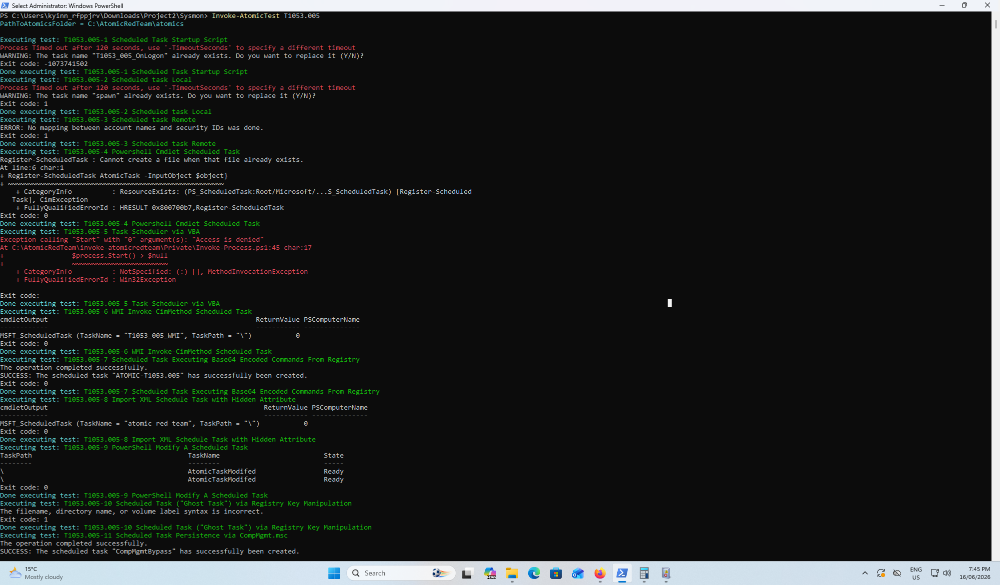
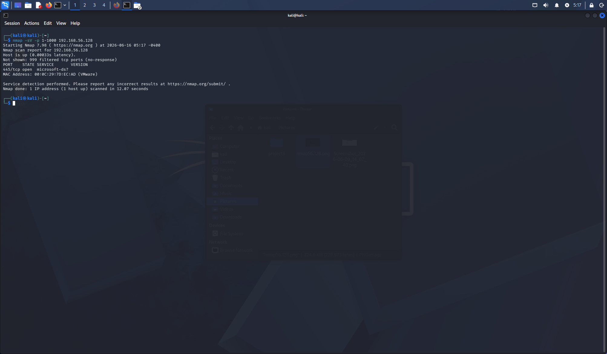

# SOC Home Lab — Splunk SIEM + MITRE ATT&CK Detection

A home lab I built to practice SOC analyst skills. Set up Splunk Enterprise as a SIEM, forwarded logs from a Windows VM and Kali Linux, installed Sysmon for endpoint visibility, then simulated attacks using Atomic Red Team and wrote detection rules in Splunk.

This was mainly built to get hands-on experience with the tools I'd actually use as a SOC analyst — log forwarding, writing detection queries, and mapping findings to MITRE ATT&CK.

---

## Lab Environment

| Machine | OS | IP | Role |
|---|---|---|---|
| Windows VM | Windows 11 | 192.168.56.128 | Splunk Enterprise + Target |
| Kali VM | Kali Linux | 192.168.56.129 | Attacker |

Both VMs running on **VirtualBox** with a host-only network adapter (192.168.56.x range is VirtualBox's default host-only subnet).

> **Note on vmware-network.log:** The Kali inputs.conf monitors `/var/log/vmware-network.log` — this comes from VMware Tools being installed inside the Kali VM (common even on VirtualBox) for guest additions functionality. The hypervisor is VirtualBox; VMware Tools is just a guest package.

---

## What's in this repo

```
soc-home-lab/
├── splunk-configs/         # inputs.conf and outputs.conf for both forwarders
├── sysmon/                 # Sysmon config (SwiftOnSecurity)
├── detection-rules/        # Splunk SPL queries mapped to MITRE ATT&CK
├── attack-outputs/         # Raw terminal output from Atomic Red Team tests
├── screenshots/            # Evidence screenshots from the lab
└── docs/                   # Step-by-step setup notes
```

---

## Setup Overview

### 1. Splunk Enterprise
- Installed on Windows VM (port 8000)
- Created 3 indexes: `wineventlog`, `sysmon`, `syslog`
- Configured receiving on port 9997

### 2. Sysmon
- Installed with [SwiftOnSecurity config](https://github.com/SwiftOnSecurity/sysmon-config)
- Captures process creation (EventCode 1), process access (EventCode 10), network connections (EventCode 3), and more
- Forwarded to Splunk via Universal Forwarder

### 3. Universal Forwarder — Windows
- Forwarding Windows Security logs + Sysmon to `127.0.0.1:9997`
- Had to run the forwarder as `LocalSystem` to fix channel access permission issue on Sysmon/Operational log

### 4. Universal Forwarder — Kali
- Installed manually (splunk.com was blocked on Kali's network, transferred .deb via Python HTTP server from Windows VM)
- Forwarding `/var/log/dpkg.log` and `/var/log/vmware-network.log` (Kali uses journald — no /var/log/auth.log or /var/log/syslog)
- Had to add a Windows firewall inbound rule for port 9997

---

## Attack Simulations (MITRE ATT&CK)

Used [Atomic Red Team](https://github.com/redcanaryco/invoke-atomicredteam) to simulate attacks on the Windows VM and detect them in Splunk.

| Technique | Tactic | Tool | Result |
|---|---|---|---|
| T1003.001 — LSASS Memory | Credential Access | Atomic Red Team | Blocked by Defender; Sysmon EventCode 10 (ProcessAccess) still logged the attempt |
| T1059.001 — PowerShell | Execution | Atomic Red Team | Multiple tests ran; CommandLine field shows encoded payloads and bypass flags |
| T1053.005 — Scheduled Task | Persistence | Atomic Red Team | Tasks created via schtasks.exe; detected via Sysmon EventCode 1 CommandLine |
| T1021.002 — SMB Lateral Movement | Lateral Movement | Atomic Red Team | Admin share mapped; loopback test meant 4624 LogonType=3 didn't fire (documented gap) |
| T1046 — Network Recon | Discovery | nmap (Kali) | Port 445 identified; no reliable host-based detection — documented gap |
| T1110 — Brute Force | Credential Access | Hydra (Kali) | 13 failed login events (EventCode 4625) — detected with threshold query |

> **T1003.001:** Defender blocked execution but the access *attempt* still fires Sysmon EventCode 10 (ProcessAccess to lsass.exe). Detection is based on GrantedAccess flags, not binary name — renaming the tool doesn't evade it.

> **T1046:** Nmap port scans aren't reliably detectable from host-based logs alone. EventCode 5156/5157 (WFP) fires but volume is too high without aggregation. Real detection requires network-level IDS or flow data. Documented as a gap.

---

## Detection Approach

All detection rules are in [`detection-rules/splunk_queries.md`](detection-rules/splunk_queries.md).

The queries use EventCode-specific searches with field extractions (rex) rather than raw string grep — searching for "mimikatz" in unstructured text is bypassable by renaming a binary. Field-based detection on behavior (e.g., GrantedAccess flags for LSASS, CommandLine content for PowerShell flags) is more robust.

Example — T1003.001 LSASS access detection using EventCode 10 + GrantedAccess:
```spl
index=sysmon EventCode=10
| rex field=_raw "TargetImage>(?<TargetImage>[^<]+)"
| rex field=_raw "SourceImage>(?<SourceImage>[^<]+)"
| rex field=_raw "GrantedAccess>(?<GrantedAccess>[^<]+)"
| where like(lower(TargetImage), "%lsass%")
| where GrantedAccess IN ("0x1010", "0x1410", "0x1418", "0x1438", "0x143a", "0x1fffff")
| table _time, host, SourceImage, TargetImage, GrantedAccess
| sort -_time
```

---

## Screenshots

### Splunk Setup
| | |
|---|---|
|  |  |
| Index: syslog | Index: sysmon |
|  |  |
| Index: wineventlog | SOC Dashboard |

### T1003.001 — LSASS Credential Dumping




### T1059.001 — PowerShell Execution


### T1053.005 — Scheduled Task Persistence



### T1021.002 — SMB Lateral Movement


### T1046 — Network Recon (Kali)


### T1110 — Brute Force (Kali + Hydra)


### Windows Defender — Atomic Red Team Detections


---

## Known Issues / Documented Gaps

- **EventCode 4698 (scheduled task created):** Didn't fire on Windows 11 22H2 even with audit policy enabled via `auditpol`. Used Sysmon EventCode 1 process monitoring as workaround — more reliable anyway.
- **T1021.002 loopback gap:** SMB test was loopback (`\\127.0.0.1\C$`), so EventCode 4624 LogonType=3 didn't fire. In a real multi-host lateral movement scenario from a different machine this would generate a network logon event. Sysmon EventCode 3 (network connection to port 445) is a usable fallback.
- **T1046 host-based detection gap:** Host-based logs (Windows Security / Sysmon) can't reliably detect Nmap scans without network-level IDS or flow data.
- **Sysmon/Operational channel permissions:** The forwarder needs to run as LocalSystem to read this log — standard user context doesn't have access.
- **Kali log sources:** Kali uses journald, so there's no /var/log/auth.log or /var/log/syslog. Using dpkg.log and vmware-network.log as available sources. A real Kali attack box would need auditd or custom log forwarding configured.

---

## Tools Used

- [Splunk Enterprise](https://www.splunk.com/) — SIEM
- [Sysmon](https://learn.microsoft.com/en-us/sysinternals/downloads/sysmon) — Endpoint telemetry
- [SwiftOnSecurity Sysmon Config](https://github.com/SwiftOnSecurity/sysmon-config)
- [Atomic Red Team](https://github.com/redcanaryco/invoke-atomicredteam) — Attack simulation
- [Hydra](https://github.com/vanhauser-thc/thc-hydra) — RDP brute force
- [Nmap](https://nmap.org/) — Network reconnaissance
- [MITRE ATT&CK](https://attack.mitre.org/) — Framework reference
- [VirtualBox](https://www.virtualbox.org/) — Hypervisor
